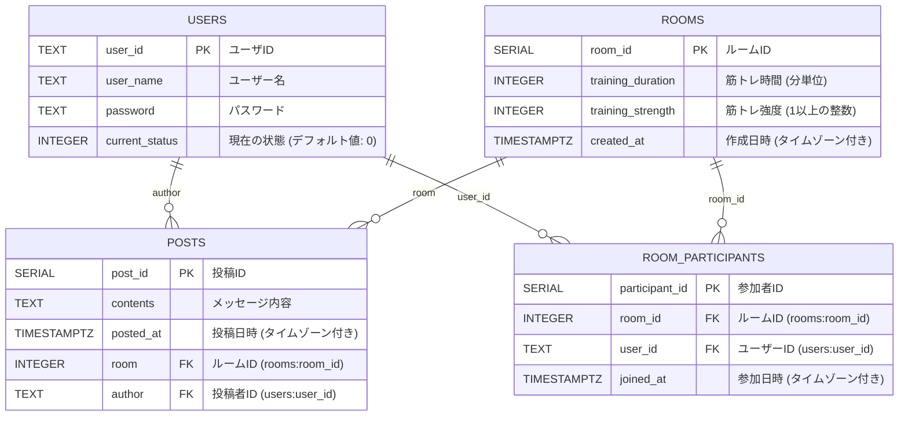

# アーキテクチャ

Created by: Keisuke Magara
Created time: 2024年10月25日 18:39

# API設計

リクエストに書いてある必須パラメーターが不足している場合、 `400 Bad Request` になります。

**~~ベースURL**：　[https://gxaf9cnsbb.execute-api.ap-northeast-1.amazonaws.com/main](https://gxaf9cnsbb.execute-api.ap-northeast-1.amazonaws.com/main)~~

**ベースURL**：　[https://gxaf9cnsbb.execute-api.ap-northeast-1.amazonaws.com/release](https://gxaf9cnsbb.execute-api.ap-northeast-1.amazonaws.com/release)

| **エンドポイント** | **リクエスト (メソッド・{}=ボディ、?=クエリ)** | **レスポンス** | **説明・備考** |
| --- | --- | --- | --- |
| /test | `GET` `POST`
?err
クエリ: なんでも
ボディ: なんでも | status-code:
200: `err` がとき
403: `err` があるとき
{
  query: {
      key:  value
  },
  body : {
    key: value
  }
} |  |
| /users/register | `POST` 
{
  “user_id”: “メルアドで使える文字列”,
  “user_name”: “日本語可、なんでも”,
  “password”: “日本語不可、記号可”
} | status-code:
200: サインアップ成功
409: `user_id` が重複していて失敗
{
  “user_id”: `user_id`
} | 新規ユーザー登録 |
| /users/login | `POST` 
{
  “user_id”: “user_id”,
  “password”: “password”
}` | status-code:
200: ログイン成功
403: ログイン失敗 (passwordミス)
404: ログイン失敗 (存在しないユーザ)
{
  “user_id”: `user_id`
} | ログイン
403と404は同じ処理でもいいはず
余裕があればエラーハンドリングでフロント側で表示するメッセージは変更する |
| /rooms/enter | `POST` 
?user_id=user_id
Body:
{
  “strength”: 3,
  “duration”: 60,
} | status-code:
200: ルーム入室成功
201: ルーム新規作成・入室成功
503: ルームをこれ以上作れない（通常絶対ないこと）
{
  “room_id”: “r12345”
} | 200と201の時は同じ処理でもいいはず
room_idは `r+数字`

リクエストのstrengthは 1以上の整数 |
| /rooms/info/{roomId} | `GET` 
?user_id=user_id | status-code:
200: 成功
403: ユーザがそのルームに入ってない
404: ルームidが見つからない
*RoomStatus-JSON*を返す | ルームの情報を得るためのAPI。
通常クライアントは画面更新のたびに呼び出すはず。
一人しかサーバーにいない場合には「マッチ中…」とかと表示するといいかも |
| /rooms/info/{roomId} | `POST` 
?user_id=user_id
{
  “content”: “太郎が腹筋10回達成！🎉”,
} | status-code:
200: 成功
403: ユーザがそのルームに入ってない
404: ルームidが見つからない
{
  “post_id”: “p12345”
} | メッセージを投稿するAPI。
post_idは `p+数字` |
| /rooms/leave | `POST`
?user_id=user_id | status-code:
200: ルーム退出成功（多重退出含む）
404: 存在しないユーザーを指定 | 部屋から退出するAPI |
| /users/status | `GET`
?user_id=user_id
`POST`
?user_id=user_id&status=2 | status-code:
200: 成功
400: statusを0未満にしている
404: 存在しないユーザーを指定
{
  “user_id”: “xxxxx”,
  “prev_status”: 0 ← POSTのみ
  “current_status”: 2 ← (新しい)状態
} | ユーザーのステータスを取得・設定するAPI |

# JSON定義

バックエンド→フロントエンドのレスポンスのひな型

## エラー時のJSON （HTTPステータスコードが200番台以外の時）

```json
{
	"message": "エラーメッセージ"
}
```

## RoomStatus-JSON

```json
{
	"room_id": "r2",
	"training_duration": 120,
	"training_strength": 2,
	"created_at": "2024-10-26 14:13:54.154205+00:00",
	"remain_lifetime": 113,  # 分
	"participants": [  # ユーザーが一人もいない場合は空リスト
		{
			"user_id": "abc@example.com",
			"user_name": "太郎",
			"joined_at": "2024-10-26 14:17:28.353169+00:00",
			"current_status": 0
		},
		{
			"user_id": "def@test.co.jp",
			"user_name": "次郎",
			"joined_at": "2024-10-26 14:22:54.521213+00:00",
			"current_status": 0
		},
		{
			"user_id": "ghi@test.co.jp",
			"user_name": "三郎",
			"joined_at": "2024-10-26 14:23:06.481455+00:00",
			"current_status": 0
		}
	],
	"posts": [  # post_atが古い順にソート済、ポストがない場合には空リスト
		{
			"post_at": "2024-10-25 20:54:32.481055+09:00",
			"author": "abc@example.com",
			"contents": "太郎は腹筋10回を終わらせた！🎉"
		},
		{
			"post_at": "2024-10-25 20:55:15.123456+00:00",
			"author": "ghi@test.co.jp",
			"contents": "三郎の休憩終了！🔥"
		}
	]
}
```

# データベース設計



## users テーブル

ユーザーに関するデータを格納します。

| **カラム** | **データ型** | **制約等** | **説明・備考** |
| --- | --- | --- | --- |
| user_id | text | primary key | ユーザID |
| user_name | text |  | ユーザーのニックネーム（公開） |
| password | text |  | パスワード |
| current_status | integer | デフォルト値：0 | ユーザーの現在の状態（例: オンライン/オフライン） |

```sql
CREATE TABLE users (
    user_id TEXT PRIMARY KEY,
    user_name TEXT,
    password TEXT,
    current_status INTEGER DEFAULT 0
);
```

## rooms テーブル

筋トレを行う各部屋に関するデータを格納します。

| **カラム** | **データ型** | **制約等** | **説明・備考** |
| --- | --- | --- | --- |
| room_id | serial | primary key | ルームID (`r+数字`) |
| training_duration | integer |  | 筋トレの時間（分単位） |
| training_strength | integer | CHECK (training_strength >= 1) | 筋トレの強度。1以上の整数で無制限 |
| created_at | timestamp | デフォルト値：現在時刻 | ルームの作成時刻 |

```sql
CREATE TABLE rooms (
    room_id SERIAL PRIMARY KEY,
    training_duration INTEGER,
    training_strength INTEGER CHECK (training_strength >= 1),  -- 1以上の整数で上限なし
    created_at TIMESTAMPTZ DEFAULT CURRENT_TIMESTAMP  -- タイムゾーン付きタイムスタンプ
);
```

## room_participants テーブル

ユーザーがどの部屋に参加しているかを管理するための中間テーブル。

| **カラム** | **データ型** | **制約等** | **説明・備考** |
| --- | --- | --- | --- |
| participant_id | serial | primary key | 参加ID。中間テーブルの一意キー |
| room_id | integer | 外部キー制約 (rooms) | 参加する部屋のID |
| user_id | text | 外部キー制約 (users) | 参加しているユーザーのID |
| joined_at | timestamp | デフォルト値：現在時刻 | 部屋に参加した時刻 |

```sql
CREATE TABLE room_participants (
    participant_id SERIAL PRIMARY KEY,
    room_id INTEGER,
    user_id TEXT,
    joined_at TIMESTAMPTZ DEFAULT CURRENT_TIMESTAMP,  -- タイムゾーン付きタイムスタンプ
    CONSTRAINT fk_room FOREIGN KEY (room_id) REFERENCES rooms(room_id),
    CONSTRAINT fk_user FOREIGN KEY (user_id) REFERENCES users(user_id),
    CONSTRAINT unique_room_user UNIQUE (room_id, user_id)  -- 同じユーザーが同じ部屋に重複参加しないようにする制約
);
```

## posts テーブル

筋トレルーム内で送信されたメッセージを格納します。

| **カラム** | **データ型** | **制約等** | **説明・備考** |
| --- | --- | --- | --- |
| post_id | serial | primary key | 投稿ID (`p+数字`) |
| contents | text |  | メッセージ内容 |
| author | text | 外部キー制約 (users) | メッセージ投稿者のユーザID |
| posted_at | timestamp | デフォルト値：現在時刻 | メッセージ投稿のタイムスタンプ |
| room | integer | 外部キー制約 (rooms) | 投稿されたルームのID |

```sql
CREATE TABLE posts (
    post_id SERIAL PRIMARY KEY,
    contents TEXT,
    author TEXT,
    posted_at TIMESTAMPTZ DEFAULT CURRENT_TIMESTAMP,  -- タイムゾーン付きタイムスタンプ
    room INTEGER,
    CONSTRAINT fk_author FOREIGN KEY (author) REFERENCES users(user_id),
    CONSTRAINT fk_room FOREIGN KEY (room) REFERENCES rooms(room_id)
);
```

# memo

## 部屋のマッチングアルゴリズム

入りたいユーザー：
**name**　xxx

**duration**　y

**strength**　z

1. yと残存時間が近い運動強度zの部屋を探す．
2. 残存時間がyと最も近い部屋Rの残存時間RTが RT ≥ y -10ならそこにいれる．
3. そうでなければ新しい部屋を作る．
4. もし，候補が複数ある場合には人数が少ないものを採用する